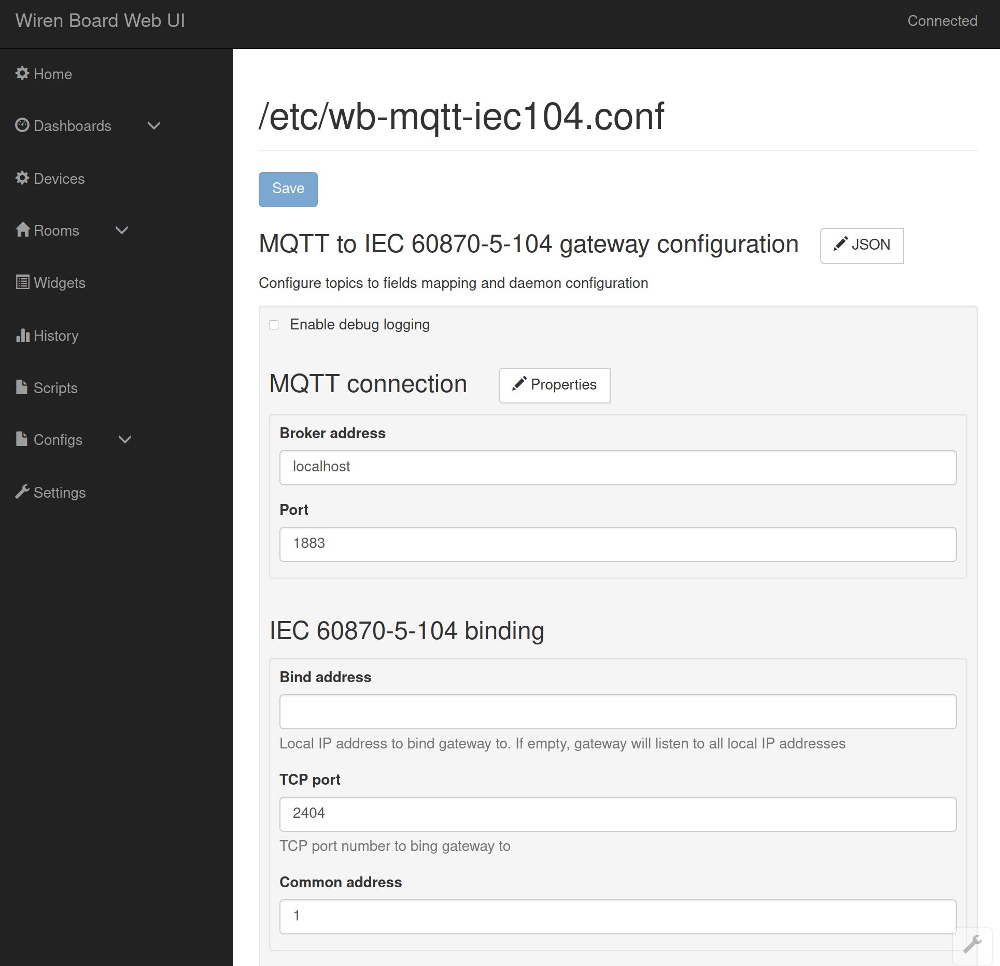
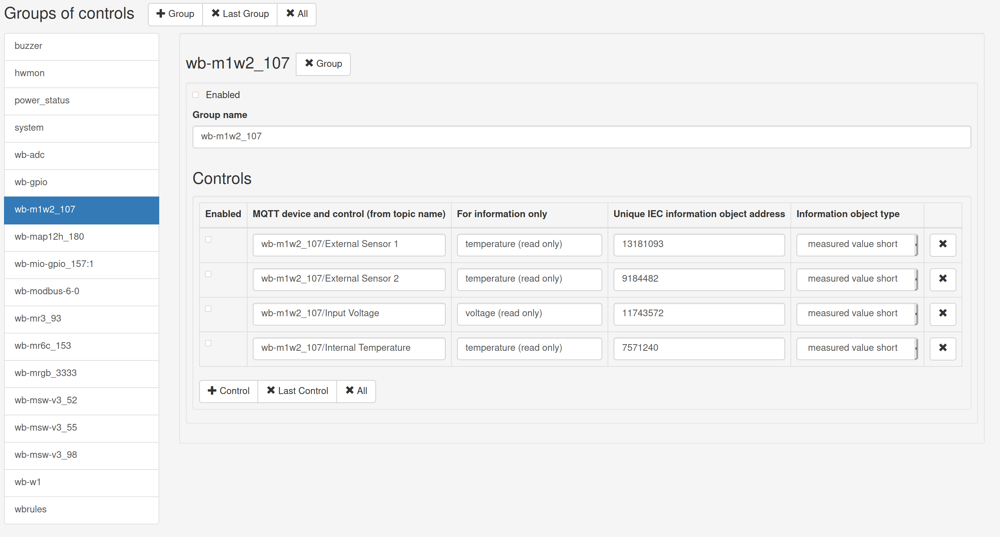

# wb-mqtt-iec104
MQTT to IEC 60870-5-104 gateway which follows [Wiren Board MQTT Conventions](https://github.com/wirenboard/homeui/blob/master/conventions.md).
It's designed to be used on [Wiren Board](https://wirenboard.com/en) family of programmable automation controllers (PACs).

Шлюз предназначен для трансляции сообщений между MQTT брокером и системами с поддержкой протокола [МЭК 60870-5-104](https://ru.wikipedia.org/wiki/IEC_60870-5).
Шлюз предназначен для устройств [Wiren Board](https://wirenboard.com/ru) и соответствует [Конвенции Wiren Board MQTT](https://github.com/wirenboard/homeui/blob/master/conventions.md).

Запускается командой `systemctl start wb-mqtt-iec104` или `service wb-mqtt-iec104 start`

По умолчанию запуск шлюза происходит при загрузке системы. При запуске шлюза происходит автоматическое создание конфигурационного файла `/etc/wb-mqtt-iec104.conf`. При последующих запусках шлюз анализирует доступные MQTT каналы(контролы) и добавляет их в файл. Активировать передачу данных конкретных каналов можно, редактируя `/etc/wb-mqtt-serial.conf`, либо воспользовавшись онлайн-редактором настроек.

Шлюз подключается к заданому MQTT брокеру и подписывается на сообщения от каналов, указанных в конфигурационном файле. В системах с поддержкой протокола МЭК 60870-5-104 шлюз выступает в роли контролируемой станции и принимает входящие TCP/IP соединения по указаному в конфигурационном файле локальному интерфейсу и порту.

Возможен запуск шлюза вручную, что может быть полезно для работы в отладочном режиме:
```
# service wb-mqtt-iec104 stop
# wb-mqtt-iec104 -d 3
```

<div style="page-break-after: always;"></div>

### Структура конфигурационного файла

```javascript
{
  // Включает/выключает выдачу отладочной информации во время работы шлюза.
  "debug" : false,

  // Настройки протокола МЭК 60870-5-104. Обязательный параметр.
  "iec104" : {
    // Общий адрес станции для шлюза. Обязательный параметр.
    "address" : 1,

    // Локальный IP адрес, на котором шлюз будет ожидать входящие соединения.
    // Обязательный параметр. Если задана пустая строка, то шлюз будет ожидать 
    // соединения по всем доступным локальным адресам.
    "host" : "",

    // Порт для входящих соединений. Обязательный параметр.
    "port" : 2404
  },

  // Настройки подключения к MQTT брокеру.
  "mqtt" : {
    // Доменное имя или IP адрес брокера. По умолчанию, "localhost".
    "host" : "localhost",

    // Порт брокера. По умолчанию, 1883.
    "port" : 1883,

    // Интервал посылки keep-alive сообщений в секундах. По умолчанию, 60.
    "keepalive": 60,

    // Требуется ли аутентификация при подключении к брокеру.
    // По умолчанию, false.
    "auth": false,

    // Имя пользователя при подключении к брокеру.
    "username": ""

    // Пароль при подключении к брокеру.
    "password": ""
  }

  // Список групп каналов, для которых осуществляется пересылка сообщений.
  // Позволяет включать/отключать пересылку сообщений для нескольких каналов,
  // редактируя только один параметр "enabled".
  "groups" : [
    {
      // Включение/отключение пересылки сообщений каналов группы.
      // Для активации пересылки надо включить конкретные каналы.
      "enabled" : true,
  
      // Имя группы.
      "name" : "buzzer",

      // Список каналов в группе.
      "controls" : [
        {
          // Включение/отключение пересылки сообщений канала.
          // Также должа быть включена пересылка на уровне группы.
          "enabled" : true,

          // Имя устройства и канала в терминах MQTT конвенции,
          // разделённые символом "/". В конкретном случае,
          // соответствующая MQTT-тема /devices/buzzer/controls/volume
          "topic" : "buzzer/volume",

          // Адрес объекта информации согласно МЭК 60870-5-104
          // для конкретного канала. Адрес может выбираться из
          // интервала [1, 16777215] и должен быть уникальным.
          // При генерации и обновлении конфигурационного файла шлюз
          // автоматически выбирает адреса для каждого канала.
          // В дальнейшем адрес можно изменить, редактируя
          // конфигурационный файл или через онлайн-редактор настроек.
          "address" : 1,

          // Идентификатор типа блока информации согласно МЭК 60870-5-104
          // Один из вариантов:
          //  "single" - одноэлементная информация (М_SP_NA_1);
          //  "short"  - значение измеряемой величины, 
          //             короткий формат с плавающей запятой (М_ME_NC_1);
          //  "scaled" - масштабированное значение измеряемой
          //             величины (М_ME_NB_1).
          "iec_type" : "short",

          // Тип канала (/devices/+/controls/+/meta/type) и возможность 
          // записи в него (/devices/+/controls/+/meta/readonly).
          // Используется для информации в интерфейсе онлайн-редактора
          // настроек. Не имеет влияния на работу шлюза.
          "info" : "range (setup is allowed)"
        },
        ...
      ]
    },
    ...
  ]
}
```

<div style="page-break-after: always;"></div>

### Передача сообщений из MQTT в МЭК 60870-5-104

Сообщения MQTT передаются в МЭК 60870-5-104 блоками данных (ASDU) с причиной передачи "спорадически"(3). При подключении нового контролирующего устройства, шлюз автоматически высылает последние известные значения всех включенных каналов. В дальнейшем каждое новое MQTT-сообщение сразу же передаётся в МЭК 60870-5-104.

### Передача команд МЭК 60870-5-104 в MQTT

Шлюз поддерживает ASDU с типами:
- одноэлементная команда (C_SC_NA_1);
- команда уставки, масштабированное значение (C_SE_NB_1);
- команда уставки, короткое число с плавающей запятой (C_SE_NC_1).

Обрабатывается первый объект информации в ASDU. Если в конфигурационном файле есть включенный канал для адреса этого объекта информации, шлюз произведёт запись полученного значения в соответствующую тему канала (например, /devices/wb-gpio/controls/5V_OUT/on).
Также поддерживается команда общего опроса станции (C_IC_NA_1, QOI равный 20), прочие команды не поддерживаются.

<div style="page-break-after: always;"></div>

### Интерфейс онлайн-конфигуратора

После установки шлюза его можно настроить в интерфейсе [онлайн-конфигуратора](https://wirenboard.com/wiki/%D0%92%D0%B5%D0%B1-%D0%B8%D0%BD%D1%82%D0%B5%D1%80%D1%84%D0%B5%D0%B9%D1%81_Wiren_Board#Settings_-.3E_Configs_.28.D0.9D.D0.B0.D1.81.D1.82.D1.80.D0.BE.D0.B9.D0.BA.D0.B8_-.3E_.D0.9A.D0.BE.D0.BD.D1.84.D0.B8.D0.B3.D1.83.D1.80.D0.B8.D1.80.D0.BE.D0.B2.D0.B0.D0.BD.D0.B8.D0.B5.29), выбрав из списка файл /etc/wb-mqtt-iec104.conf.

Онлайн-конфигуратор позволяет указать параметры подключения к MQTT-брокеру (дополнительные параметры можно выбрать, нажав на кнопку "Properties") и выбрать локальный IP и порт, по которым шлюз будет ожидать подключения.



Ниже показан интерфейс редактирования списка групп и каналов для трансляции из MQTT в МЭК 60870-5-104. По умолчанию шлюз создаёт отдельную группу для каждого устройства. Список групп расположен слева, его можно самостоятельно редактировать.



При выборе конкретной группы в правой части появится список входящих в неё каналов. Каналы так же можно создавать, удалять и редактировать. Столбец "MQTT device and control" указывает конкретный канал MQTT. Он формируется из названия устройства и канала. Для первого в списке канала соотвествующий топик MQTT будет `/devices/wb-m1w2_107/controls/External Sensor 1`. Уникальный адрес объекта информации согласно МЭК генерируется при старте сервиса, его можно изменить в столбце "Unique IEC information object address". Также можно поменять тип объекта информации.
